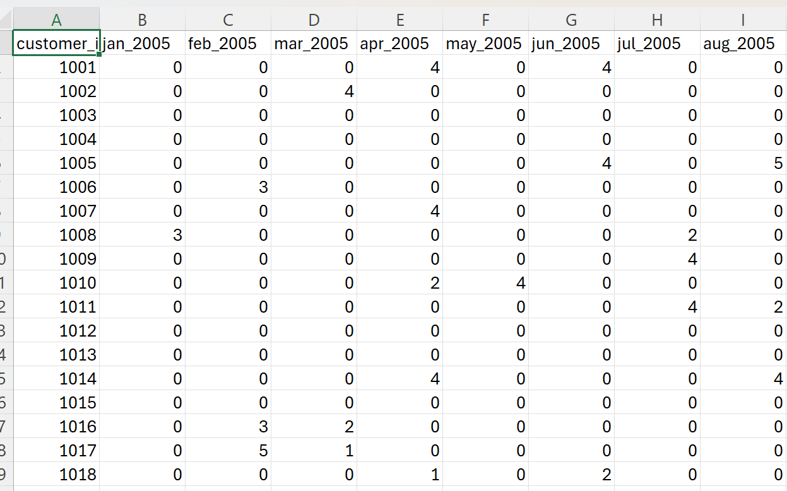
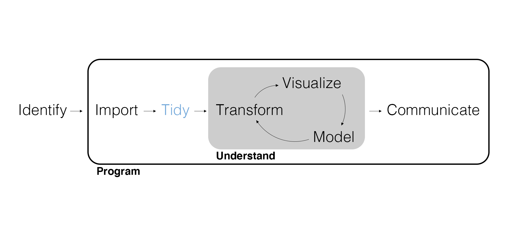
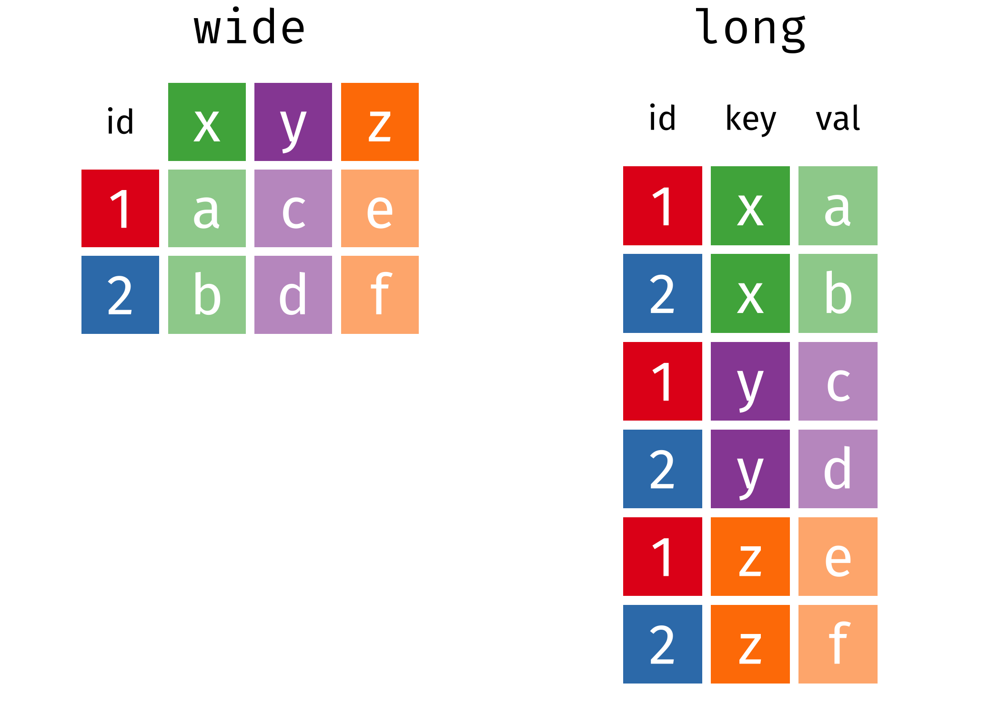

## Attention to Detail

<center>
{width=800px}
</center>

---

<center>
{width=850px}
</center>

## More About Quarto Docs - YAML

The header at the top of a Quarto document is coded in **YAML** (Yet Another Markup Language).

```
---
title: "Exercise 5"
author: "Cameron Bale"
format: docx
---
```

## More About Quarto Docs - Quarto Best Practices

- Use `##` headings and `###` sub-headings to clearly identify sections.
- Code cells begin with `'''{r}` and end with `'''` and should include *comments* but not *text*.
- Use a separate code cell for every task so that output and text can be provided *in-line*.
- Produce bullet points using '-'.
- Identify `functions` and `data` with `s, *italics* with *s, and **bold** with **s.
- Quarto also has a visual editor.
- There are options, including running all previous code or a single code cell.
- After you render, **Always read the output.**

## Motivating Example

Patagonia has requested a report on sales trends over time. What are some statistics we could compute to support this analysis? How could we compute these statistics using the Patagonia sales data?

---

<center>
{width=750px}

## This Data is Problematic!

The current data format won't allow us to perform many of the calculations we want using `tidyverse` functions.

- How do we compute the total transactions per year?
- How do we compute the number of transactions for each customer?

Luckily, we can use some functions to `tidy` our data...

## Marketing Analytics Process

<center>
{width=900px}

---

```{r}
library(tidyverse)
```

---

```{r eval=FALSE}
crm_data <- read_csv("customer_data.csv", show_col_types = FALSE) |> 
  left_join(read_csv("store_transactions.csv", show_col_types = FALSE), join_by(customer_id))
```

```{r echo=FALSE}
crm_data <- read_csv("customer_data.csv", show_col_types = FALSE) |> 
  left_join(read_csv("store_transactions.csv", show_col_types = FALSE), join_by(customer_id))
```

## Data Structure and Summarizing

Task: compute the *total* transactions and *average transactions per month per customer* for 2018 by region.

```{r}
crm_data |> 
  select(region, customer_id, contains("2018"))
```

## Tidy Data

**Tidy data** is defined as follows:

- Each observation has its own row.
- Each variable has its own column.
- Each value has its own cell.

This may seem obvious or simple, but this common philosophy is at the heart of the *tidy*verse. It also means we will often prefer **longer** datasets to **wider** datasets and {tidyr} will help us move between the two.

---

<center>
{width=750px}
</center>

## Pivot Longer

The most common identifying feature of **messy data** is when column names are really values.

```{r}
crm_data |> 
  select(region, customer_id, contains("2018"))
```

---

When column names are really values, the data frame ends up being wider than it should be. Use `pivot_longer()` to pivot the data frame longer by **turning column names into values**.

```{r}
crm_long <- crm_data |>
  select(region, customer_id, contains("2018")) |> 
  pivot_longer(
    -c(region, customer_id),
    names_to = "month_year",
    values_to = "transactions"
  )
```

---

Note how much *longer* the data frame is and *why*.

```{r}
crm_long
```

---

Now summarizing the transactions for 2018 by region is trivial.

```{r}
crm_long |> 
  group_by(region) |> 
  summarize(
    total_transactions = sum(transactions),
    avg_transactions = mean(transactions)
  )
```

## Pivot Wider

If the data has the opposite problem and has values that should really be column names, use `pivot_wider()` to pivot the data frame wider by **turning values into column names**.

```{r}
crm_long |> 
  pivot_wider(
    names_from = month_year,
    values_from = transactions
  )
```

---

<center>
{width=500px}
</center>

## Your Turn!

Is this data frame tidy? Why or why not? If not, use the appropriate pivot.

```{r}

billboard

```

## Desired Output

```{r, echo=FALSE}

billboard |> pivot_longer(
  wk1:wk76,
  names_to = "week", 
  values_to = "rank", 
  values_drop_na = TRUE
  )

```

## Solution 1

```{r, eval=FALSE}

billboard |> pivot_longer(
  wk1:wk76,
  names_to = "week", 
  values_to = "rank", 
  values_drop_na = TRUE
  )

```

## Solution 2

```{r, eval=FALSE}

billboard |> pivot_longer(
  -c(artist, track, date.entered),
  names_to = "week", 
  values_to = "rank", 
  values_drop_na = TRUE
  )

```

## Separate Columns

Sometimes columns contain more than one data value. Use `separate()` to split those values into two (or more) columns.

```{r}
crm_long
```

---

```{r}
crm_long <- crm_long |>
  separate(month_year, c("month", "year"), sep = "_")

crm_long
```

---

Now we can summarize the transactions for 2018 by region *and* month.

```{r}
crm_long |> 
  group_by(month, region) |> 
  summarize(
    total_transactions = sum(transactions),
    avg_transactions = mean(transactions)
  ) |> 
  arrange(desc(avg_transactions))
```

## Unite Columns

When two (or more) values should be in one column, `unite()` the values into one column.

```{r}
crm_long |>
  unite("month_year", c(month, year), sep = "_")
```

---

Of all the {tidyr} functions, `unite()` might seem the least useful. However, we really would like `month_year` to be an actual date. If we can add a day, we can use {lubridate} to create a date.

```{r}
crm_long <- crm_long |>
  mutate(day = 1) |> 
  unite("date", c(day, month, year), sep = "-") |> 
  mutate(date = dmy(date))

crm_long
```

---

With a long data frame and a `date` column, we can plot a time series of transactions.

```{r eval=FALSE}
crm_long |> 
  group_by(date, region) |> 
  summarize(
    total_transactions = sum(transactions),
    avg_transactions = mean(transactions)
  ) |> 
  ggplot(aes(x = date, y = avg_transactions, color = region)) +
  geom_line() +
  scale_x_date(date_breaks = "month", date_labels = "%b")
```

---

```{r echo=FALSE}
crm_long |> 
  group_by(date, region) |> 
  summarize(
    total_transactions = sum(transactions),
    avg_transactions = mean(transactions)
  ) |> 
  ggplot(aes(x = date, y = avg_transactions, color = region)) +
  geom_line() +
  scale_x_date(date_breaks = "month", date_labels = "%b")
```

## Data Classes and Types

We've been using **data frames** (technically **tibbles**, a modern data frame). A data frame is composed of columns called **vectors**. Both data frames and vectors are classes of data.

Each vector has a *single* data type. We've discussed **double** (i.e., numeric), **integer**, **date**, **character**, and **factor**. If we try to mix data types in a vector, R will *coerce* one data type to match the other.

```{r}
vector_example <- c(1, 2, "three")

vector_example
```

---

Data frames are nice to work with because each vector can be of a different data type.

```{r}
tibble(id = 1:3, state = "AZ")
```

## Coercion

Sometimes we need to **coerce** a data class or type.

```{r}
as_tibble(vector_example)
```

Why would we want to coerce a data class?

We can similarly coerce data types with `as.*()` functions (e.g., `as.numeric()` and `as.character()`).

## Your Turn!

Suppose you are building a ggplot visualization that shows the distributions of customer incomes for different zip codes. However, R is treating the values of zip code as a numeric value. Is this correct? If not, what data type might make more sense? Perform the appropriate coercion.

```{r}

zip_codes <- c(30301, 60614, 90210, 10001, 73301, 02138, 44101, 84101, 19104, 96815)

glimpse(zip_codes)

```

## Desired Output

```{r, echo=FALSE}

zip_codes <- as.character(zip_codes)

glimpse(zip_codes)

```

## Code Solution

```{r, eval=FALSE}

zip_codes <- as.character(zip_codes)

glimpse(zip_codes)

```

---

We often want to coerce factors using the `fct_*()` functions.

```{r}
crm_data |> 
  mutate(region = fct_infreq(region)) |> 
  ggplot(aes(x = region)) +
  geom_bar()
```

---

Note that `geom_bar()` is a wrapper for both `count()` and `geom_col()` (i.e., only a single variable is needed and the count is performed as part of the plot).

We've already used `fct_reorder()` to coerce a factor ordered by another variable. Now we've used `fct_infreq()` to coerce a factor ordered by frequency and, if you like, `fct_rev()` to reverse that order.

---

```{r}
crm_data |> 
  mutate(region = region |> fct_infreq() |> fct_rev()) |> 
  ggplot(aes(x = region)) +
  geom_bar()
```


## Live Coding Exercise

Let's return to the motivating example. Patagonia has requested a report on sales trends over time. Let's put together a plot to go in that report.

## Wrapping Up

*Summary*

- Discussed the philosophy of tidy data.
- Practiced {tidyr} functions for tidying data.
- Considered data classes, types, and coercion.

*Next Time*

- Querying databases.

*Supplementary Material*

- *R for Data Science (2e)* Chapters 6 and 30

*Artwork by @allison_horst*

## Exercise 5

Customers are often analyzed based on those who have made recent purchases, frequent purchases, and spent the most. This is known as a recency, frequency, monetary (RFM) analysis. Now that we can tidy data, we can analyze customers based on recent purchases and frequent purchases. In RStudio, create a new Quarto document and do the following.

1. How would you define customers who have made "recent" purchases? State how you are defining recency, and use R to report on the composition of these customers.
2. How would you define customers who have made "frequent" purchases? State how you are defining frequency, and use R to report on the composition of these customers.
3. Render the Quarto document into Word and upload to Canvas.

